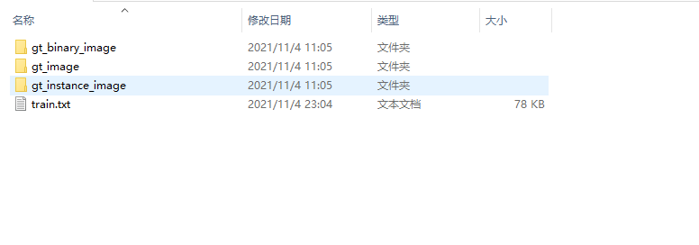

## English

### Environment

It is recommended to use vscode to open it, otherwise some unexpected problems may occur

Create a virtual environment using Anaconda:

python3.7+  
torchvision>=0.9.1  
pytorch>=1.8.1  
sklearn  
Pillow>=8.2.0  
opencv-python>=4.5.1  
matplotlib>=3.1.3  
numpy>1.21.2  
tqdm

It is recommended to use the `conda install`command to install the above dependencies


### Demo video
<video src="./demo/demo.mp4" width="512px" height="256px" controls="controls"></video>
（If the video cannot be played, you can open it in the demo folder）
### Algorithm
The original lanenet model is shown in the figure below

This paper improves the original model:
1. Absolute position of lane line is introduced
2. Use kmeans algorithm instead of mean shift algorithm
3. Remove the h-net module

The general structure of the model is shown in the figure below


See the paper for details

### Demo
We provide `demo.py` for users to quickly demonstrate the model 

This file will load a pre training model to detect the lanes in the picture and output the results. The output results are roughly as shown in the figure: 


### Create dataset
This paper uses the tusimple dataset to pre train the model, and uses the self labeled data for training. If you also want to establish your own dataset, you can use the following methods 
#### 1. Install Labelme
Labelme is a JavaScript annotation tool for online image annotation. Compared with traditional image annotation tools, its advantage is that we can use this tool anywhere. In addition, it can also help us label images without installing or copying large data sets on the computer. 

It is recommended to use `pip install` to install the tool 

#### 2. Batch processing of annotation files
windows 10： 
Write the following statement in a file, change the suffix to `.bat`, and run 
``` bash
@echo off
for %%i in (*.json) do labelme_json_to_dataset "%%i"
pause
```

Linux：
Give permission to run and run 

#### 3. Generate datasets in tusimple format
Run `generate_tusimple_dataset.py` script to generate corresponding training set 


**Note if the files' path are correct** 

### Training model
You can use the `train.py` script to train the model. The model will be saved in the `checkpoints` folder every 100 times 

Adam optimization is used by default. The learning rate is 0.0005 and the number of iterations is 2000 

#### Pre training model
The following points should be paid attention to when using tusimple data set for model pre training： 
1. When calling the `main` function, please set the keyword `type` to `pre_train`
2. Please set the `dataset` keyword in `utils.cli_helper` correctly

#### Formal training
The following points need to be paid attention to during model training: 
1. Please set the `model_path` variable of `train.py` function reasonably 
```python
model_path = "Your pre training model"
```
2. When calling the `main` function, please do not set the keyword `type` to `pre_train` 

### Test model
We provide a test function to estimate the accuracy of the model and the calculation time, just call `test.py` 

However, when using this file, please set the value of the `test_dataset_file,model_path` variable in the `main` function reasonably 

```python
test_dataset_file = os.path.join(args.dataset, 'The file that contains the test set path')
model_path = "Your pre training model"
```
### reference

We refers to some other people's code, the link is as follows:

1. https://github.com/MaybeShewill-CV/lanenet-lane-detection

2. https://github.com/klintan/pytorch-lanenet

======================================================================
## 简体中文
### 运行环境

推荐使用vscode打开，否则可能会产生一些意外的问题

使用anaconda创建虚拟环境:

python3.7+
torchvision>=0.9.1
pytorch>=1.8.1
sklearn
Pillow>=8.2.0
opencv-python>=4.5.1
matplotlib>=3.1.3
numpy>1.21.2
tqdm

推荐使用`conda install`命令安装上述依赖

### 演示视频
<video src="./demo/demo.mp4" width="512px" height="256px" controls="controls"></video>
(如果视频无法播放，可以在demo文件夹中打开)
### 算法模型
原始Lanenet模型如下图所示

本文原始模型的基础上进行了改进：
1. 引入了车道线的绝对位置
2. 使用Kmeans算法代替mean-shift算法
3. 去除H-net模块

模型大致架构如下图所示


具体细节见论文
### 快速演示
本文为提供了一些工具，方便用户快速对模型进行演示
```bash
python demo.py
```
该文件会加载一个预训练模型，对图片中的车道进行检测并输出结果
输出结果大致如图所示：


### 创建数据集
本文使用tusimple数据集对模型进行预训练，并使用自己标注的数据进行训练，如果你也想建立自己的数据集，可以采用以下方式
#### 1. 安装Labelme
LabelMe 是一个用于在线图像标注的 Javascript 标注工具。与传统图像标注工具相比，其优势在于我们可以在任意地方使用该工具。此外，它也可以帮助我们标注图像，不需要在电脑中安装或复制大型数据集。

推荐使用`pip install`安装该工具

#### 2. 对标注文件进行批处理
windows 10：
将以下语句写在一个文件中，并将尾缀更改为`.bat`，并运行
``` bash
@echo off
for %%i in (*.json) do labelme_json_to_dataset "%%i"
pause
```

Linux：
给予运行权限，并运行

#### 3. 生成tusimple格式数据集
运行`generate_tusimple_dataset.py`脚本，生成对应训练集


**注意各个文件之间的路径正确**

### 训练模型
可以使用`train.py`脚本训练模型，模型每100次就会保存在`checkpoints`文件夹下

默认使用Adam优化，学习率为0.0005，迭代次数为2000次
#### 预训练模型
使用tusimple数据集进行模型预训练需要注意以下几点：
1. 在调用`main`函数时，请将关键字`type`设置为`pre_train`
2. 请将`utils.cli_helper`中的`dataset`关键字设置正确

#### 正式训练
进行模型训练需要注意以下几点：
1. 请合理设置`train.py`函数`model_path`变量
```python
model_path = "Your pre training model"
```
2. 在调用`main`函数时，请不要将关键字`type`设置为`pre_train`

### 测试模型
本文编写了一个测试函数，用于对模型的精度以及计算时间进行估算，调用`test.py`即可

不过，在使用该文件时，请合理设置`main`函数中的`test_dataset_file,model_path`变量值
```python
test_dataset_file = os.path.join(args.dataset, 'The file that contains the test set path')
model_path = "Your pre training model"
```
### 参考

本文参考了部分他人代码，链接如下:

1. https://github.com/MaybeShewill-CV/lanenet-lane-detection

2. https://github.com/klintan/pytorch-lanenet
